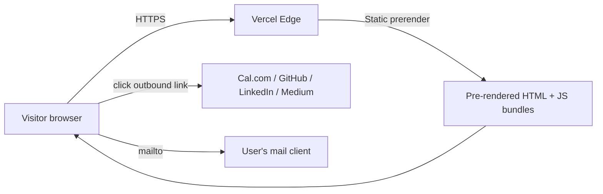
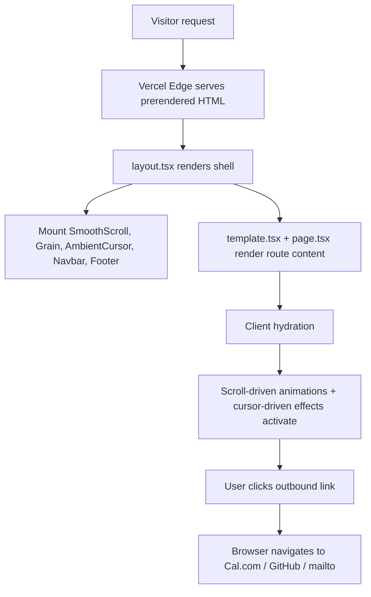
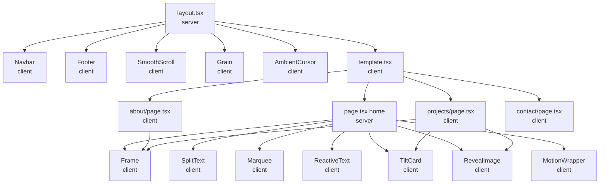

# Architecture and Implementation

System map, third-party inventory, and walkthrough of the code's organization.

## System overview

Cyberlounge.net is a static Next.js 15 App Router site deployed on Vercel. Four public routes (`/`, `/about`, `/projects`, `/contact`), all prerendered as static HTML at build time. No backend, no database, no auth, no API routes, no server actions. Outbound interactions are anchor links to third-party services (Cal.com, GitHub, LinkedIn, Medium, `mailto:`).



**Topology:** monolith. **Hosting:** Vercel (managed). **Build:** Vercel-controlled, triggered by push to `main`.

## Tech stack

| Layer | Choice |
|---|---|
| Framework | Next.js 15.5.18 (App Router) |
| Runtime | React 19 |
| Language | TypeScript 5.7 |
| Styling | Tailwind CSS 3.4 + custom CSS variables in `src/app/globals.css` |
| Animation | Framer Motion 12 + Lenis 1.3 (smooth scroll) + Web View Transitions API |
| Typography | next/font/google: Geist sans, Geist Mono, Fraunces (variable serif) |
| Iconography | react-icons (Font Awesome, Simple Icons, Bootstrap Icons subsets) |
| Image optimization | next/image with `fill` + manual `objectFit` via inline style |

## File layout

```
src/
  app/
    layout.tsx              Root layout: fonts, metadata, mounts SmoothScroll / Grain / AmbientCursor / Navbar / Footer
    page.tsx                Home (server component with embedded client components)
    template.tsx            Pathname-keyed wrapper enabling View Transitions
    globals.css             Design tokens + utility classes + view-transition keyframes
    about/page.tsx          Bio + dossier + timeline + practice principles
    projects/page.tsx       Three project plates with corner metadata
    contact/page.tsx        Schedule (Cal.com CTA) + channels list
  components/
    Navbar.tsx              Sticky top nav with active-route accent underline + mobile menu
    Footer.tsx              Title-block footer with corner metadata
    Frame.tsx               Reusable architectural "title block" wrapper with scroll-draw hairlines
    MotionWrapper.tsx       Client-boundary re-export of motion.div
    SmoothScroll.tsx        Lenis provider, runs in raf loop
    Grain.tsx               Canvas-generated animated film grain (mix-blend-overlay)
    AmbientCursor.tsx       Cursor-following radial gradient (z-0 backdrop)
    SplitText.tsx           Char-by-char reveal with variable-font weight morph
    Marquee.tsx             Looping horizontal text strip
    RevealImage.tsx         Project image wrapper with scroll-into-view color flood
    TiltCard.tsx            Subtle 3D tilt on hover (CSS perspective + transform)
    ReactiveText.tsx        Cursor-reactive body type (per-word displacement)
public/
  profile.jpg               About-page portrait
  projects/                 Three project images (logo, portrait, character art)
  *.svg                     Default Next.js icon SVGs (some unused, kept for safety)
docs/
  ai/                       AI-context docs (memory, roadmap, tasks, decisions, architecture)
  plans/                    Two long-form plan documents for the Architect redesign
  audit/                    This audit
CODE_MAP.md, ENTRY_POINTS.md, DATA_FLOW.md, IMPORT_GRAPH_SUMMARY.md, FEATURE_BOUNDARIES.md
README.md, llms.txt
package.json, tailwind.config.ts, tsconfig.json, eslint.config.mjs, postcss.config.mjs
next.config.ts (enables experimental.viewTransition and allows-list Medium image CDN remotes)
```

## Design system

CSS variables in `src/app/globals.css` define the palette; Tailwind theme tokens in `tailwind.config.ts` reference them. The two files must stay in sync (documented in `docs/ai/architecture.md`).

Current (light mode after commit `d1972c0`):

| Token | Value | Role |
|---|---|---|
| `--background` | `#fafaf7` | Warm off-white page background |
| `--ink` | `#14141a` | Near-black body and heading color |
| `--muted` | `#6e6e76` | Secondary text |
| `--rule` | `#d8d6cf` | Hairline strokes around frames |
| `--surface` | `#f1efe9` | Elevated card / image backdrop |
| `--accent` | `#8a6a3d` | Deeper brass; used sparingly for active state and hover |
| `--hero-opsz` | `144` | Fraunces variable axis target |

Utility classes added beyond Tailwind: `.label`, `.label-ink`, `.rule`, `.hero-opsz`, `.link-accent`.

## Critical-path data flow



No data leaves the user's device except outbound navigation to other sites the user explicitly clicks.

## Third-party services and SDKs

| Service | Surface | What it sees | Privacy implication |
|---|---|---|---|
| Vercel | Hosting | Request path, user-agent, IP for routing/analytics if enabled | Standard Vercel privacy posture; no analytics is currently enabled |
| Google Fonts (build time) | `next/font/google` self-hosts fonts at build | Nothing at runtime - fonts are bundled in `.next` output | Build-time only; visitors do not contact Google Fonts |
| Cal.com | Outbound link only | Whatever Cal.com collects on its booking page | User explicitly opts in by clicking |
| GitHub / LinkedIn / Medium / mailto | Outbound link only | Same | Same |

**Net.** No first-party analytics. No third-party SDKs that ping home from the browser. The site has effectively zero data exfiltration surface.

## Component layering



**Coupling.** Tree-shaped. No circular dependencies. No barrel files. Path alias `@/*` maps to `src/*`. Direct module imports throughout.

## Code walkthrough by feature

### Home (`/`)

Top title-block strip. Massive serif "Nicholas Perry" hero with char-by-char reveal (`SplitText`) and weight morph from 300 to 600. Below the hero: a positioning paragraph wrapped in `ReactiveText` (per-word cursor-reactive displacement). Two CTAs: View Projects (filled) and Get in Touch (outlined). A `Marquee` strip between the hero and Capabilities. Then a `<Frame>` for Capabilities containing four skill groups (Web Dev, Cloud Architecture, Database Systems, Platforms & CRM), each as a grid of `<SkillCard>` items. Then a second `<Frame>` for Selected Work containing three project cards wrapped in `<TiltCard>` + `<MotionDiv>` for entry animation, with images via `<RevealImage>` (color-floods on scroll-into-view).

### About (`/about`)

Top title-block strip. Portrait + dossier hero: framed portrait plate on the left, body copy on the right. Three subsequent `<Frame>` sections: Expertise (two cards), Experience (timeline as 5 entries), Practice (three principles).

### Projects (`/projects`)

Top title-block strip. Page-level hero (`Projects.` in Fraunces). Three project plates in a vertical stack, each with corner metadata, alternating image-left/right layout, tagline + description, stack chips + Visit Site link in a bottom rail. Closing CTA to `/contact`.

### Contact (`/contact`)

Top title-block strip. Hero (`Let's talk.`). Two-column card: Schedule (Cal.com CTA + bulleted list of what the intro call covers) on the left, Channels (GitHub / LinkedIn / Medium / Email) on the right.

## Verification plan

| Item | Method | Status |
|---|---|---|
| `npm run lint` | Command run by Claude during audit | VERIFIED clean |
| `npm run build` | Command run by Claude during audit | VERIFIED clean (4 static routes prerender) |
| `npm audit` | Command run by Claude during audit | VERIFIED (2 moderate; see F-005) |
| Secret scan over full git history | Bash grep across `git log -p --all` | VERIFIED clean |
| Image regression (BUG-001) | Visual check via screenshot from user | VERIFIED resolved |
| Spacing regression (BUG-002) | Visual check via screenshot from user | VERIFIED resolved |
| Page transitions | Cross-browser visual; not run by Claude | STATIC-ONLY (build artifact confirms `experimental.viewTransition` accepted) |
| Touch / reduced-motion paths | Code-read of the `prefers-reduced-motion` and `pointer: coarse` guards | STATIC-ONLY |
| Branch protection on `main` | Cannot inspect from local clone | HYPOTHESIS (likely none) |

## Known constraints

- Site is fully static. Any future dynamic feature (contact form, real auth, server-side analytics) needs a Next.js route handler or server action, and would change the security posture.
- Tailwind 3 to 4 and Next 15 to 16 upgrades are deferred. See `dependencies.md`.
- OG cover image is referenced but not present. See `bugs.md#BUG-003`.

---
generated_by: codebase-audit skill v1.0
generated_on: 2026-05-19
project: C:/Users/Perry/Dropbox/PC/Documents/GitHub/portfolio
project_type: node
verification: full
---
